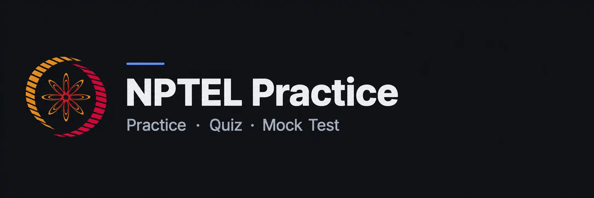

# NPTEL Practice

Frontend-only app for practicing NPTEL quizzes. Pick a course, pick a week, get quizzed.
All data is static JSON under `courses/`; progress is stored in the browser's `localStorage`.

```bash
npm install
npm run dev        # validates courses/, then starts Vite
npm run build      # validates, type-checks, builds to dist/
npm run validate   # only check the course JSON
```

The build uses `HashRouter` and a relative base, so `dist/` works on any static host
(GitHub Pages, Netlify, Cloudflare Pages, …) with no server config.

## Deploying (Vercel) + search/analytics setup

Live at **nptel.danny.co.in**. Steps that need your own accounts (can't be done from here):

1. **Push to GitHub**, then [import the repo in Vercel](https://vercel.com/new) — it
   auto-detects Vite, no config needed (build `vite build`, output `dist`).
2. **Add the domain**: Vercel project → Settings → Domains → add `nptel.danny.co.in`.
   It'll show you a DNS record to create; add that at wherever `danny.co.in`'s DNS is
   managed, then wait for it to verify (follow Vercel's on-screen instructions exactly —
   the record it asks for can vary by plan/region).
3. **Google Search Console**: add a property for `https://nptel.danny.co.in`, verify
   ownership (HTML-tag or file method is simplest once the site is live), then submit
   `https://nptel.danny.co.in/sitemap.xml` under Sitemaps. Note: the app uses `HashRouter`
   (`#/c/...` URLs), which browsers never send to the server — so only the root `/` is a
   crawlable, indexable page. That's expected; it's also why `sitemap.xml` only lists one
   URL. Individual course/week pages won't show up as separate search results.
4. **Microsoft Clarity**: create a project for the site, copy its Project ID.
5. **Google Analytics (GA4)**: create a property, copy its Measurement ID (`G-XXXXXXX`).
6. In Vercel → Settings → Environment Variables, add:
   ```
   VITE_CLARITY_ID=<id from step 4>
   VITE_GA_MEASUREMENT_ID=<id from step 5>
   ```
   Then **redeploy** — these get baked into `index.html` as static `<script>` tags at
   build time (see the Vite plugin in `vite.config.ts`), so just saving the env vars
   doesn't retroactively affect the last build. Either one can be left unset to skip that
   tracker. Neither ever loads in `npm run dev` — only `vite build` — so local testing
   never pollutes real data. `.env.example` documents both vars for local testing if you
   want it. (They're injected as static tags rather than loaded at runtime via JS because
   gtag.js silently drops its own tracking hit when it detects a dynamically-inserted
   script tag instead of one present in the parsed HTML — confirmed by testing directly.)
7. *(Optional, worth it)* **UptimeRobot** (free): add a monitor for
   `https://nptel.danny.co.in`. Neither of the above tracks uptime — this is the actual
   source if you want a real uptime number/status page to cite.

## Adding content

One folder per course under `courses/`. The folder name is a unique id used in URLs.

```
courses/
└── CFOC657M/
    ├── course.json      # required
    ├── week_1.json
    ├── week_2.json
    └── week_N.json      # sorted numerically: week_10 comes after week_2
```

New folders and files are picked up automatically; there is no index to update.
If the same course runs in several sessions, use one folder per run (e.g. `entrepreneurship-2025`,
`entrepreneurship-2026`) and put the differences in `course.json`.

### course.json

```json
{ "name": "Understanding Incubation and Entrepreneurship", "code": "CFOC657M", "semester": "Winter", "session": 2026 }
```

All four keys are required. `session` is the year for now.

### week_N.json

```json
{
  "title": "Week 1",
  "description": "Short summary of the week's topics",
  "questions": [
    { "id": 1, "question": "…", "options": ["A", "B", "C", "D"], "correctOption": 3 },
    { "id": 2, "question": "…", "options": ["A", "B", "C", "D"], "correctOption": [0, 1] }
  ]
}
```

- `correctOption` is a **0-based** index into `options`.
- A number renders radio buttons (one answer); an array renders checkboxes (multi-select),
  even if it has a single item. A multi-select question is correct only if the selection
  matches the array exactly.
- `id` must be unique within a week.
- Option order is never shuffled (so "All of the above" always stays put).
- `question` is rendered as **Markdown** (CommonMark + GitHub tables, via `react-markdown` +
  `remark-gfm`): `\n` starts a new paragraph, `- `/`1. ` lines become a list, `**bold**`,
  `*italic*`, `` `code` ``, links, and `| a | b |` tables all work. `options` stay plain text
  (no markdown) — keep those short and literal. Two Markdown quirks worth knowing:
  - A line right after a list item with no blank line between them gets absorbed into that
    item instead of starting a new paragraph — put a blank line (`\n\n`) before the line
    that should follow the list.
  - A line that should start with a literal hyphen needs escaping (`\- like this`), or it's
    read as a list item.

  Example:
  ```
  "Refer to the statements given below:\n- Statement 1: ...\n- Statement 2: ...\nChoose the correct options:"
  ```
- A question that needs an image (a graph, diagram, etc.) references it with Markdown image
  syntax, pointing at a file under that course's own `images/` folder:
  ```
  courses/<course>/
  ├── course.json
  ├── images/
  │   └── week_1_q10.png
  └── week_1.json
  ```
  ```
  "question": "What can be inferred from the graph shown below?\n\n"
  ```
  The path always starts with `/courses/<course-folder>/images/`. `npm run validate` checks
  the file actually exists; a path that doesn't resolve shows a visible "Image not found"
  placeholder in the app instead of a silently broken image, so a typo is obvious either way.

`npm run validate` checks all of this and reports the file and question at fault. Unknown keys
(e.g. a typo like `correctOptions`) are reported as warnings.

### Generating a week_N.json with an LLM

Paste this into a new chat (ChatGPT, Claude, etc.) along with screenshots of each question —
including whichever UI shows the accepted/correct answer. Fill in `{week_no}` / `{title}` /
`{description}` / `{course_folder}` (the course's folder name under `courses/`) at the top,
then send it after the question screenshots.

`````
We've gone through the quiz questions for this week in this conversation and in the attached
screenshots (question text, options, and whichever one is marked/accepted as correct).

Convert **every finalized question** into one JSON object for this exact schema:

- `title`: `"Week {week_no}"`
- `description`: `"{description}"` — a short one-line summary of the week's topics
- `questions`: an array containing every finalized question, in the order they were covered

Each question object:
- `id`: sequential integer starting from 1, no gaps or repeats
- `question`: the finalized question text (Markdown — see below)
- `options`: every answer option, in their original order
- `correctOption`: the correct answer, as a 0-based index into `options`

### Rules

1. Include **every** question shown or discussed — don't skip, merge, or summarize any.
2. Preserve exact wording. Don't paraphrase, shorten, reorder words, or fix apparent typos in
   the question or options — transcribe them as given.
3. `options` must stay in the **same order** as the source. Never reorder, sort, or alphabetize
   them — some options (e.g. "All of the above") depend on their position.
4. `correctOption` is **0-based**: 1st option → `0`, 2nd → `1`, 3rd → `2`, 4th → `3`, etc.
5. **One correct answer** → `correctOption` is a single number (the app renders radio buttons).
   **Multiple correct answers** → `correctOption` is an array of numbers, e.g. `[0, 2]` (the
   app renders checkboxes, and marks it correct only if the selection matches that set
   exactly). The app already shows "Select all that apply" on its own for array questions —
   don't add that phrase into the question text yourself.
6. `options` are always **plain text** — no Markdown formatting inside an option.
7. `question` is rendered as **Markdown** (CommonMark + GitHub-flavored tables). Use it where
   the source needs it, but don't add formatting that isn't actually there:
   - Several statements ("Statement 1: ...", "Statement 2: ...") → one bullet per statement,
     each line starting with `- `.
   - A reference table the question depends on (e.g. a List I / List II matching question) →
     a Markdown table: a header row, a `| --- | --- |` separator row, then the data rows.
   - `**bold**`, `*italic*`, `` `inline code` ``, and links also work if the source has them.
   - A blank line is required between the end of a list and the paragraph after it — without
     one, that next line gets absorbed into the list's last item instead of standing alone.
   - A line that must start with a literal hyphen (not a bullet) needs escaping: `\- like this`.
8. If a question depends on an image you can't transcribe as text (a graph, diagram, map,
   chart, etc.), don't describe or summarize it in prose. Insert a Markdown image reference
   at that point instead, using this exact path shape:
   ``
   and separately tell me after the JSON (outside the code block) which question(s) need an
   image added, so I remember to supply the actual file.
9. Output **valid JSON only** — no explanations, no commentary, no text outside the JSON, no
   extra fields beyond the ones above — in a single code block. (Exception: the image
   call-out from rule 8, which goes after the code block, not inside it.)
10. Before answering, re-check your output against the full conversation and every screenshot:
    confirm no question was dropped, and that each `correctOption` matches the option that was
    actually marked or accepted as correct.

### Example (covers every case: single-answer, multi-answer, a multi-statement question, a table-based question, and one needing an image)

```json
{
  "title": "Week X",
  "description": "Short summary of the week's topics",
  "questions": [
    {
      "id": 1,
      "question": "What role does empathy play while designing a product?",
      "options": [
        "Enhances aesthetics",
        "Reduces manufacturing costs",
        "Fosters competition among designers",
        "Promotes user-centered design"
      ],
      "correctOption": 3
    },
    {
      "id": 2,
      "question": "What characteristics are crucial for building an ideal team?",
      "options": [
        "A varied skill set and diverse perspectives",
        "Singular expertise in a specific domain",
        "Strong communication and collaboration",
        "A homogeneous team with similar backgrounds"
      ],
      "correctOption": [0, 2]
    },
    {
      "id": 3,
      "question": "Refer to the statements given below:\n- Statement 1: Sustainable development meets the needs of the present without compromising the ability of future generations to meet their own needs.\n- Statement 2: By adopting Sustainable measures, the natural resources can be conserved and alternate sources of power can be used without harming the environment.\n\nChoose the correct option:",
      "options": [
        "Both statements are true",
        "Only statement 1 is true",
        "Only statement 2 is true",
        "Both statements are false"
      ],
      "correctOption": 0
    },
    {
      "id": 4,
      "question": "Match the List I with List II and select the correct answer using the codes given below the lists:\n\n| List I | List II |\n| --- | --- |\n| A) \"Penny-farthing\" bicycle | 1. Twin engine |\n| B) Tupolev Tu-144 | 2. Air cushion |\n| C) Bombardier Global express | 3. James Starley |\n| D) Maglev | 4. Breaking the sound barrier |",
      "options": [
        "A-3, B-4, C-2, D-1",
        "A-4, B-3, C-2, D-1",
        "A-3, B-4, C-1, D-2",
        "A-4, B-3, C-1, D-2"
      ],
      "correctOption": 2
    },
    {
      "id": 5,
      "question": "What can be inferred from the graph shown below?\n\n",
      "options": [
        "Two-wheelers account for the major share of road transportation",
        "The share of two-wheelers was roughly equal to cars, jeeps and taxis in the 1970s",
        "Both of the above are true"
      ],
      "correctOption": 2
    }
  ]
}
```

(For question 5 above, I'd also tell you afterward: "Question 5 needs an image at
`/courses/{course_folder}/images/week_{week_no}_q5.png` — please add the actual file.")

Generate the final Week {week_no} - "{title}" with every question, option, and correct option
from this conversation and the attached screenshots.
`````

## Layout

```
courses/                 quiz content (JSON)
scripts/validate-courses.mjs
src/
  lib/courses.ts         discovers courses/weeks via import.meta.glob, normalizes questions
  lib/progress.ts        localStorage progress (best score, attempts, missed ids)
  pages/                 CourseList, WeekList, Quiz
  components/            QuizSession (one question at a time), Results
```

Routes: `#/` → courses, `#/c/<course>` → weeks, `#/c/<course>/w/<n>` → quiz.
Keyboard in a quiz: `1`–`9` select an option, `Enter` checks the answer / moves on.
